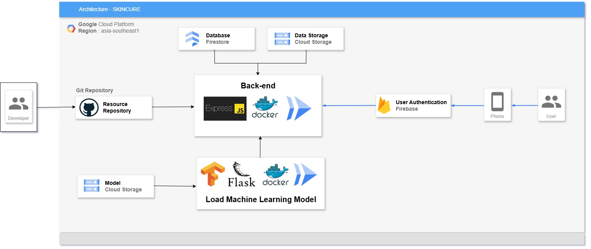

Model ML diproses pakai framework Flask, backend lainnya menggunakan framework Express.js

Diagram Alur Kerja
1. Client mengirimkan permintaan (misalnya gambar) ke Express.js.
2. Express.js memverifikasi token autentikasi (menggunakan Firebase), memastikan permintaan sah.
3. Express.js kemudian mengirimkan gambar (biasanya menggunakan request HTTP) ke Flask.
4. Flask memproses gambar tersebut dengan model machine learning dan menghasilkan prediksi.
5. Flask mengembalikan hasil prediksi ke Express.js.
6. Express.js mengirimkan hasil prediksi ke Client.

